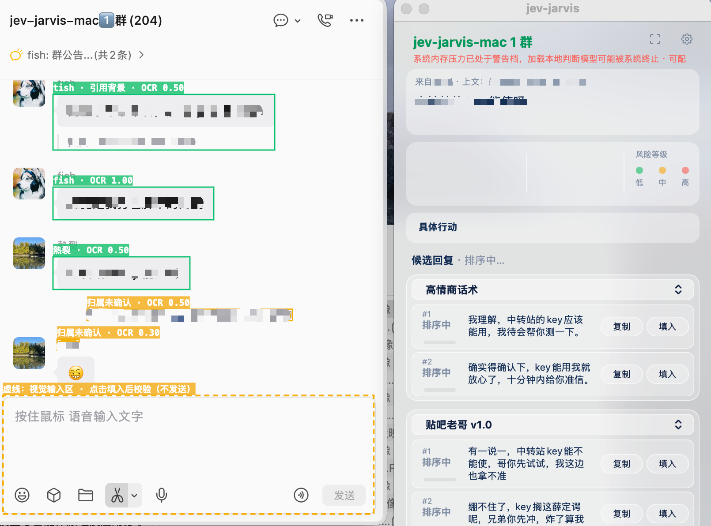
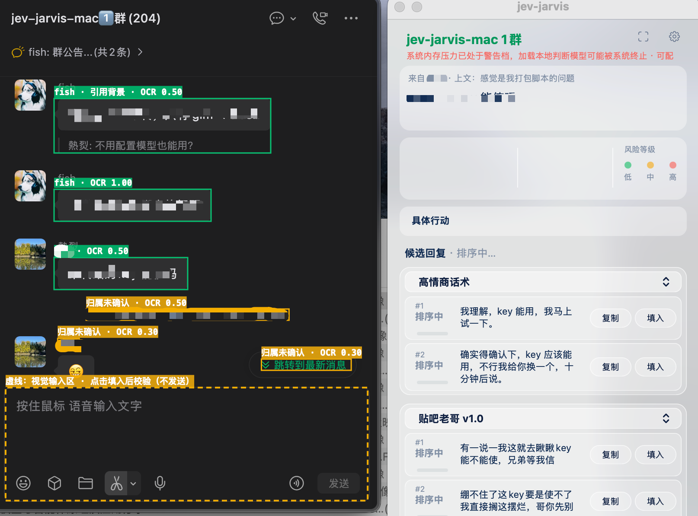

# 截图识别路径实机验证

本文记录 PR #140 的验证环境、浅色/深色实机效果和期望识别结果。截图由测试者在真实聊天应用和运行中的助手上截取并脱敏，展示消息、检测框和在线生成的候选。

## 环境

| 项目 | 实测环境 |
|---|---|
| 目标应用 | 4.1.13（269631） |
| 系统 | macOS 26.6.2 |
| 窗口 | 带联系人侧栏的应用主窗口，群聊 |
| 主题 | 标准浅色、标准深色 |
| 验证日期 | 2026-09-28—29 |
| 原始回放样本尺寸 | 窗口 734×599 点，PNG 1468×1198 像素 |

下方公开效果图裁取聊天区与助手面板，尺寸与原始回放 PNG 不同。原始截图和录制 OCR 含私人内容，仅保存在测试者本机；这些带检测框和脱敏遮盖的效果图用于目视核对，不作为原始 OCR 回放输入。

## 实机效果

### 浅色主题



### 深色主题



两张图保留拍摄时的「系统内存压力已处于警告档」和「排序中」提示：当时既有内存保护拦住本地判断模型，在线候选仍已生成并上屏。本 PR 未修改内存保护或排序机制；这些提示不属于本次识别修改，也不影响用图中检测框和候选核对识别效果。图中状态不用于证明本地判断或排序已经完成。

## 对应期望结果

正文已脱敏，因此以下按画面位置说明期望，不还原私人文字，也不提供与打码图不一致的逐字 OCR 断言。

| 画面内容 | 期望处理 | 图中可核对的结果 |
|---|---|---|
| 从上到下三个带绿色主框的文字气泡 | 分别作为正文；已关联昵称仅作发言人标签 | 三个主框保持分离，标签显示发言人 |
| 第一条正文下方的竖线引用 | 归属于第一条消息，作为背景，不独立成为新发言 | 第一条主框包含正文和引用，标签含「引用背景」 |
| 顶部固定群公告 | 不作为消息正文或回复目标 | 公告条没有消息检测框 |
| 下方琥珀色「归属未确认」文字 | 不进入回复目标、模型上下文或历史 | 保留未确认标签，不强行归入对方消息 |
| 底部橙色虚线输入区 | 作为输入区展示，不把输入草稿当消息 | 输入区与消息主框分开 |
| 右侧候选面板 | 对已确认的正文生成候选，引用作为背景供模型理解 | 浅色、深色均已显示在线候选 |

消息历史、模型请求和“引用不单独触发回复”等内部行为由离线集成回归验证；单张效果图不单独证明这些内部状态。两图没有保留左侧联系人列表，宽侧栏的完整几何来自本机原始样本验证。

## 已验证范围与边界

| 验证方式 | 范围与结果 |
|---|---|
| 浅色原始截图/OCR 回放 | 2 份下方引用布局各得到 2 条正文、2 段引用；1 份普通消息布局保留 5 条正文。自动、手动识别及回复目标/历史检查通过 |
| 深色原始截图/OCR 回放 | 1 份下方引用布局得到 4 条正文、1 段引用。自动、手动识别及回复目标/历史检查通过 |
| 实机运行 | 浅色、深色均验证读屏、检测框、在线候选生成和上屏；浅色另已完成本地判断及排序验证。全程未填入或发送 |
| 布局覆盖 | 本机完整样本覆盖宽侧栏、圆角短气泡、多行正文、昵称、固定公告、下方竖线引用及新消息浮层排除；公开效果图展示其中的聊天区和候选面板 |

分类器使用气泡与背景的相对色差和边界，标准深色已有实测。低对比度、透明或无气泡背景的自定义主题仍未验证，可能漏读、误判或标为归属未确认；手动校准只调整区域，不能补足缺失的气泡边界。

独立聊天窗、全屏、其他应用版本，以及真实内嵌引用、复杂混合引用和无竖线独立引用尚未在本次实机验收中覆盖。自动、手动两条路径的离线回放通过，不代表所有模式与主题组合均完成实机全流程验收。

现有合成截图/OCR 集成回归可在仓库根目录运行：

```sh
uv run --locked python -B -m unittest discover -s tests -p 'test_recognition.py'
```

该命令验证识别、上下文和历史等行为，不会重新读取聊天窗口，也不把上述脱敏效果图作为测试输入。
